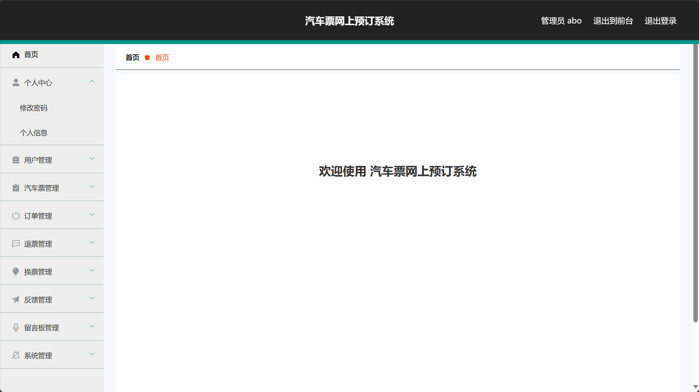

介绍
基于springboot+vue的电影票线上购票系统

开发环境
操作系统 ： windows

Java环境 ： JDK1.8

开发工具 ： Idea 2021

数据库： mysql 5.5以上

spring boot : 2.1.7 Release

使用说明
后台地址
http://localhost:8080/springboot0t1t7/admin/dist/index.html

管理员  abo 密码 abo

前台地址：http://localhost:8080/springboot0t1t7/front/index.html

下面是一些功能展示
用户登录界面：
 
首页

